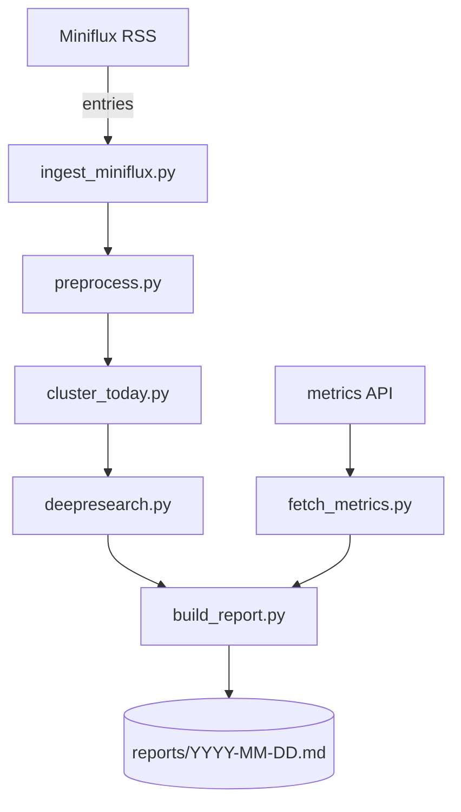
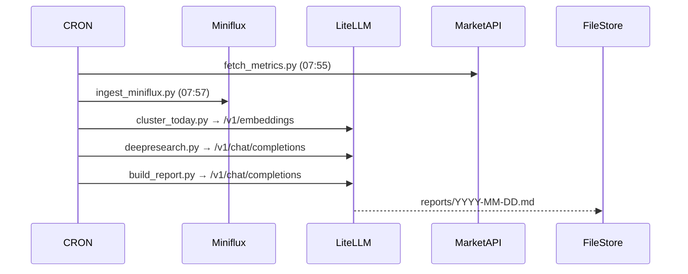

# 🧩 System Design Document (SDD)

**Project Name**：Crypto Daily Intelligence
**Version**：1.0
**Author**：Oliver Yu
**Date**：2025-11-04
**Status**：Design Complete / Implementation Ready

---

## 1. 系統設計概述（System Overview）

### 1.1 系統定位

Crypto Daily Intelligence 是一個以 **Miniflux RSS** 為主資料源、輔以 **行情指標與 ETF 流向** 的自動化報告系統。
整合 LiteLLM 作為本地 AI 推理層（LLM + Embedding），每天自動生成結構化的「加密市場情報報告」。

### 1.2 系統目標

* 完成每日定時報告自動生成。
* 能應對大量 RSS 內容（>300 篇/日）。
* 主題歸納清晰且可追溯。
* 所有步驟均模組化、可獨立重跑。
* 可擴展至週報、Telegram 通知、Graph RAG。

---

## 2. 系統架構（System Architecture）

### 2.1 分層架構圖

```text
┌──────────────────────────────┐
│           User / Analyst     │
│   (read .md report or API)   │
└──────────────┬───────────────┘
               │
┌──────────────┴────────────────────────────┐
│           Application Layer (FastAPI / CLI)│
│ ┌───────────────┐ ┌───────────────┐        │
│ │ build_report  │ │ deepresearch  │ ...    │
│ └───────────────┘ └───────────────┘        │
└──────────────┬─────────────────────────────┘
               │
┌──────────────┴────────────────────────────┐
│              Data Pipeline Layer          │
│  ingest_miniflux → preprocess → cluster   │
│  → metrics → research → report            │
└──────────────┬────────────────────────────┘
               │
┌──────────────┴────────────────────────────┐
│              Infrastructure Layer         │
│  LiteLLM Proxy / Miniflux API / Storage   │
│  (local: data/, config/, cron/)           │
└───────────────────────────────────────────┘
```

---

## 3. 系統模組設計（Module Design）

### 3.1 模組清單

| 模組                   | 主要功能                | 輸入                          | 輸出                        | 依賴                             |
| -------------------- | ------------------- | --------------------------- | ------------------------- | ------------------------------ |
| `fetch_metrics.py`   | 查詢市場行情指標            | 外部 API                      | metrics/YYYY-MM-DD.json   | CoinGecko, Coinglass           |
| `ingest_miniflux.py` | 從 Miniflux 拉 RSS    | Miniflux API                | raw/YYYY-MM-DD.jsonl      | Token                          |
| `preprocess.py`      | 清洗與標準化              | raw                         | normalized                | N/A                            |
| `cluster_today.py`   | 向量化 + 相似度分群         | normalized                  | topics/YYYY-MM-DD.json    | LiteLLM `/v1/embeddings`       |
| `deepresearch.py`    | 對每個 topic 呼叫 LLM 深研 | topics                      | research/YYYY-MM-DD.jsonl | LiteLLM `/v1/chat/completions` |
| `build_report.py`    | 生成 Markdown 報告      | metrics + research + prompt | reports/YYYY-MM-DD.md     | LiteLLM `/v1/chat/completions` |

---

## 4. 資料流與時序圖（Data Flow & Sequence Diagram）

### 4.1 Data Flow Diagram (Level 1)



### 4.2 Sequence Diagram



---

## 5. 資料模型（Data Model）

### 5.1 `normalized` 條目結構

```json
{
  "item_id": "miniflux:22:123456",
  "title": "Binance 將上架 XXX",
  "text": "Binance 公告將上架 XXX，交易將於……",
  "source": "Binance Announcement",
  "published_at": "2025-11-04T05:30:00Z",
  "url": "https://..."
}
```

### 5.2 `topics` 結構

```json
{
  "topic_id": "2025-11-04-001",
  "title": "BTC ETF 大額流出，市場震盪",
  "count": 5,
  "representative_text": "ETF 流出成為今日焦點...",
  "items": [
    {
      "title": "ARK ETF 出現 1.2 億美元流出",
      "source": "The Block",
      "url": "https://..."
    }
  ]
}
```

### 5.3 `research` 結構

```json
{
  "topic_id": "2025-11-04-001",
  "summary": "多家 ETF 出現淨流出，顯示機構短期避險。",
  "impact": "中性偏空",
  "sentiment": 4,
  "watch_symbols": ["BTC", "ETH"],
  "recommendation": "觀望或輕倉",
  "source_count": 5
}
```

### 5.4 `metrics` 結構

```json
{
  "as_of": "2025-11-04T08:00:00+08:00",
  "btc": { "price": 70123.5, "change_24h": -1.25 },
  "eth": { "price": 3620.1, "change_24h": 0.85 },
  "market": { "total_cap": 2.65, "total_change_24h": -0.6 },
  "derivatives": { "liq_total_24h_usd": 430.0, "long_ratio": 58.2 },
  "etf": { "btc_spot_flow_usd": -120.5, "eth_spot_flow_usd": 15.2 }
}
```

---

## 6. API 介面定義（Interfaces）

### 6.1 LiteLLM Embedding API

```bash
POST /v1/embeddings
Authorization: Bearer sk-admin
{
  "model": "local-embed",
  "input": ["text"]
}
```

**Response**

```json
{"data":[{"embedding":[-0.03,0.05,...]}]}
```

### 6.2 LiteLLM Chat Completion

```bash
POST /v1/chat/completions
Authorization: Bearer sk-admin
{
  "model": "rag-answer",
  "messages": [
    {"role":"system","content":"你是分析師..."},
    {"role":"user","content":"請生成報告..."}
  ]
}
```

### 6.3 Miniflux Entries

```bash
GET /v1/categories/{id}/entries?published_after={timestamp}&limit=300
Header: X-Auth-Token: ${MINIFLUX_TOKEN}
```

---

## 7. 模組內部設計（Detailed Module Design）

### 7.1 cluster_today.py

**主要流程**

1. 載入 normalized JSONL
2. 以 `/v1/embeddings` 產生向量矩陣
3. cosine similarity → 群聚
4. 呼叫 LLM 命名主題

**演算法**

* 使用閾值分群（similarity > 0.82）
* 主題命名：取前 3–5 篇標題丟 LLM
* 向量模型：`bge-m3`

---

### 7.2 deepresearch.py

**功能**

* 對每個 topic（title + representative_text + items）呼叫 LLM 進行摘要與判斷。

**Prompt 結構**

```text
請根據以下主題的多則新聞，歸納：
- topic_title
- summary
- impact
- sentiment (0-10)
- watch_symbols
```

**輸出 JSON**
與 research 檔案格式相同。

---

### 7.3 build_report.py

**邏輯**

1. 讀取 `metrics/YYYY-MM-DD.json`
2. 讀取 `research/YYYY-MM-DD.jsonl`
3. 載入 `config/report_prompt.md`
4. 組合一個完整 user message：

````text
今日市場數據：
```json
{metrics.json}
````

今日主題分析：

```json
[research.jsonl內容]
```

請依照以下模板產出報告：
===模板===
(report_prompt.md)

```

**呼叫**
`POST /v1/chat/completions` → model: `rag-answer`

**輸出**
Markdown → `data/reports/YYYY-MM-DD.md`

---

## 8. 排程與運行（Scheduling & Execution）

| 時間 | 任務 | Script | 備註 |
|------|------|--------|------|
| 07:55 | 行情資料 | fetch_metrics.py | 儲存 metrics |
| 07:57 | RSS 收集 | ingest_miniflux.py | |
| 08:00 | 清洗 | preprocess.py | |
| 08:01 | 分群 | cluster_today.py | |
| 08:02 | 深研 | deepresearch.py | |
| 08:05 | 報告 | build_report.py | 生成 .md |
| 08:10 | 通知 | n8n webhook (選用) | 推送報告摘要 |

---

## 9. 錯誤處理與重試（Error Handling）

| 類別 | 錯誤 | 處理方式 |
|------|------|----------|
| API timeout | 連線中斷 | retry 3 次（間隔 5 秒） |
| LLM 無回覆 | 超時 | 記錄警告，輸出 N/A topic |
| Miniflux 無資料 | 空輸出 | 產生「今日無新 RSS」報告 |
| metrics 空值 | null → N/A | LLM 自動填補 |
| Embedding 失敗 | 跳過該篇 | log `_embed_fail` |

所有 log 存於 `data/logs/YYYY-MM-DD.log`。

---

## 10. 部署與執行環境（Deployment Environment）

| 組件 | 執行位置 | 備註 |
|------|----------|------|
| LiteLLM Proxy | localhost:9400 | 已連接 `ollama/bge-m3` |
| Miniflux | rss.meowcoder.com | 已開 API Token |
| 系統主程式 | Ubuntu 24.04 / Python 3.11+ | GPU 非必須 |
| 儲存 | `data/` 目錄 | 可同步至 S3 / MinIO |
| Cron | `/etc/cron.d/crypto_report` | 台灣時區 (Asia/Taipei) |

---

## 11. 監控與維運（Monitoring & Maintenance）

| 模組 | 監控項目 | 工具 / 方法 |
|------|----------|--------------|
| Pipeline | 成功 / 失敗次數 | log + Slack webhook |
| LLM | 回覆時間 | log latency |
| 報告 | 檔案存在性 | daily checksum |
| Cron | 任務執行 | systemd timer 或 n8n flow |
| 磁碟使用量 | data/ | du -sh 或監控代理 |

---

## 12. 擴充設計（Extensibility Design）

| 擴充項目 | 設計說明 |
|-----------|-----------|
| **Twitter/X Feeds** | 新增 `ingest_twitter.py` 模組，輸出到 normalized，同步進 cluster。 |
| **Telegram 頻道** | 以 Telegram Bot API 拉訊息，同樣進入 preprocess。 |
| **GraphRAG 整合** | 將 topics embeddings 寫入 Qdrant，用於語義檢索。 |
| **週報生成功能** | 從 reports/ 讀取近 7 日報告，彙整成 `weekly-summary.md`。 |
| **多語版報告** | build_report.py 第二階段再翻譯成英文，存 EN.md。 |

---

## 13. 系統安全（Security）

- 所有金鑰（LiteLLM、Miniflux、API）存在 `.env` 或 `config/app.yaml`。  
- 報告檔案不含使用者個資。  
- 可新增簡易 AES 機制加密 metrics 檔案（可選）。  
- LiteLLM Proxy 僅限 127.0.0.1 訪問。  

---

## ✅ 14. 總結（Implementation Summary）

**主要任務順序**

1. 📊 `fetch_metrics.py` — 查行情  
2. 📰 `ingest_miniflux.py` — 拉 RSS  
3. 🧹 `preprocess.py` — 清洗  
4. 🧩 `cluster_today.py` — 分群 + 命名  
5. 🧠 `deepresearch.py` — LLM 深研  
6. 🧾 `build_report.py` — 組報告  

**最終產出：**
```

data/reports/2025-11-04.md

```

**報告內容結構固定：**
- 一、市場總覽  
- 二、熱門主題  
- 三、潛在機會  
- 四、重大消息與風險  
- 五、市場情緒  
- 六、關鍵影響者  
- 七、AI 綜合洞察  
- 八、觀察清單  
- 九、結語  
